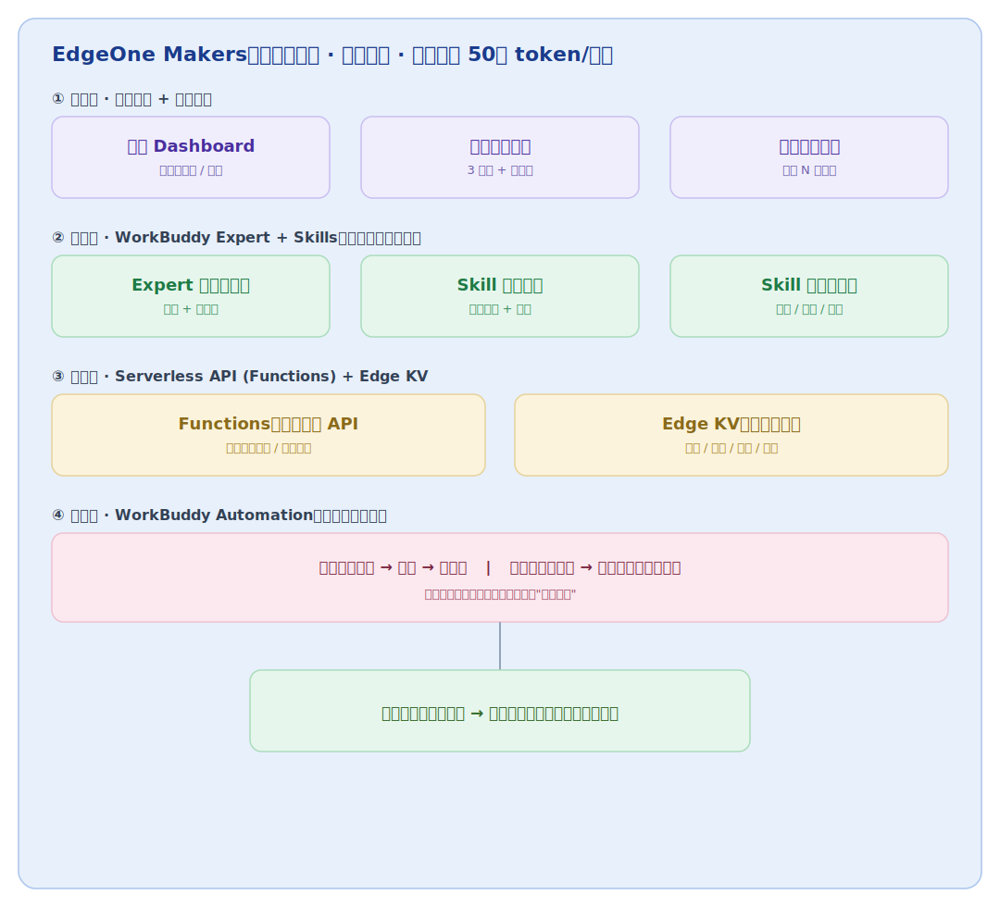

# 知微 ZhiWei — 项目方案书

> 副标题：数据驱动的选题命中系统 · 面向个人创作者的选题命中与多平台发布分析
> 命名出处：《易·系辞》「知微知彰」——见微小征兆而预判大势，恰是从数据里读出爆款苗头（原代号「选题罗盘」）
> AI 黑客松 · 命题方向 B（内容创作与发布分析）· 基于 WorkBuddy + EdgeOne Makers 部署

---

## 0. 一句话定位

**别人的工具帮你"把内容写出来"，选题罗盘帮你"决定写什么最值得写"** —— 基于你自己的历史发布数据 + 实时热点，为每个候选选题打出"预期命中分"，让内容创作从拍脑袋变成数据驱动，并把一篇稿子自动适配到多平台，发布后数据再回流让系统越用越准。

---

## 1. 我们要解决的真实痛点

个人创作者（公众号 / 视频号 / 小红书 / 知乎博主）的真实困境不是"不会写"，而是三件事：

| 痛点 | 现状 | 代价 |
|---|---|---|
| **不知道写什么** | 选题靠灵感、靠模仿爆款，命中率靠运气 | 产量不低但爆款稀少，投入产出比差 |
| **一稿多改太耗时** | 同一篇内容手动改 4~5 个平台版本、单独排版、单独出封面 | 每篇多花 1~2 小时在机械适配上 |
| **数据不回流** | 发布后各平台数据分散，很少系统复盘 | 无法沉淀"什么选题/标题真正有效"的经验 |

选题罗盘把这三件事串成一个**自我强化的闭环**：数据回流越多，选题评分越准，命中率越高。

---

## 2. 命题契合度：为什么这个方案能拿分

评审四个硬指标，逐一对齐：

| 评审维度 | 本方案如何满足 |
|---|---|
| **可运行** | **已真实部署到 EdgeOne Pages**：React SaaS 前端（看板 / 评分 / 录入 / API 文档）+ 7 个边缘函数 API（`health / stats / posts CRUD / score / admin·seed / openapi.json / docs`）全部跑通，绑定自定义域名 `topic.yeranyang.com` 稳定访问；WorkBuddy 侧 Skill/Expert/Automation 真实可用 |
| **可验证** | 内置"命中率看板"，量化整体命中率、高置信关键词、时段规律、**标题模式命中率对比**、按选题排名；评分引擎对每个候选选题输出**可解释的评分构成**（四维度拆解）+ 命中理由 + 发布建议 |
| **可复用** | 核心资产是 WorkBuddy 的 **Expert 包 + Skills + Automation**，任何创作者导入即可用；后端为纯函数分析引擎 + 存储抽象层，非一次性脚本 |
| **真实业务场景** | 直接基于真实公众号/多平台运营数据（作者本人长期运营，数据真实、痛点真切） |

一句话：这个方案**同时命中"技术惊艳点"（选题评分）和"完整闭环"（创作→发布→回流→更准）**，且全程可量化、可复用。

---

## 3. 系统架构

四层结构，全部部署在 EdgeOne Makers 同一项目中（Web 与 Agent 共享域名、配置、部署流水线）。



- **① 应用层**（前端 SPA，Pages 托管）：Vite + React + TS 构建的双语 SaaS，含四个页面——命中率**看板**（整体命中率 / 高置信关键词 / 时段规律 / 标题模式命中率 / 选题排名 + 钻取抽屉）、批量**选题评分**（多候选打分 + 评分构成拆解 + 发布建议）、发布记录 **CRUD**（新增/编辑/删除，热度自动计算）、交互式 **API 文档**（Swagger UI）。
- **② 智能层**（WorkBuddy Expert + Skills，可复用核心资产）：Expert 选题评分官（打分 + 给理由）、Skill 选题雷达（热点抓取 + 归纳）、Skill 多平台改写（语气 / 长度 / 标签）。
- **③ 数据层**（Serverless：Edge Functions + Edge KV）：7 个边缘函数 API 端点（见第 4.2 节），`posts` 端点提供完整增删改查数据回流，`analytics.js` 纯函数引擎产出命中率模型与可解释评分（Wilson 置信下界排序，避免小样本虚高）；`store.js` 存储抽象层在生产 Edge KV 与本地文件降级间无缝切换。
- **④ 自动化层**（WorkBuddy Automation，定时驱动闭环）：每日抓热点 → 评分 → 推简报；每周回流数据 → 生成命中率复盘周报。
- **闭环**：数据越用越准 → 选题命中率持续上升（可量化）。

> **关键技术决策**：EdgeOne Makers 是边缘 Serverless 环境，**不使用**传统 Node 长驻进程 + 本地 `node:sqlite`，改用 **Edge KV** 存储选题历史库，数据回流通过 **Pages Functions** 暴露的轻量 API 写入。这是从"本地开发"迁到"边缘部署"必须做的适配。

---

## 4. 部署方案（EdgeOne Makers 实录）

本项目已**真实部署到腾讯云 EdgeOne Makers**（黑客松官方指定的技术支持平台），前端页面与动态 API 在同一项目、共享域名与部署流水线。这一节记录真实落地过程与关键决策，答辩时可直接讲"部署是怎么跑通的、遇到什么约束、怎么解决"。

### 4.1 为什么选 EdgeOne Makers
- **黑客松官方技术支持**：每位选手免费 50 万 token/月，可直接调用平台内置大模型，天然契合"接模型做选题评分"的需求。
- **一体化部署**：前端页面（Pages 托管）+ 动态 API（Pages Functions / 边缘函数）+ Agent 运行时同项目部署，共享域名，省去多平台拼接。
- **全球边缘 + Serverless**：无需自己维护服务器，天然高可用、低延迟。

### 4.2 项目结构与 API 端点

```
app/                          # EdgeOne 部署根（控制台 Root Directory = app）
├─ edgeone.json               # 构建配置：install/build 命令、outputDir=./dist、Node 20.18.0
├─ package.json               # workspaces=["web"]，"type":"module"
├─ dev-server.mjs             # 本地边缘函数模拟（目录路由 + 注入本地 KV），离线调试
├─ web/                       # 前端 SPA（Vite + React + TS）
│  └─ src/{pages,components,lib}   # Dashboard/Score/Posts/ApiDocs + 组件 + api 客户端
├─ functions/                 # 边缘函数（目录即路由表）
│  ├─ api/                    # 见下方端点表
│  └─ _lib/                   # store（存储抽象）/ analytics（评分引擎）/ http / openapi / seed-data
├─ scripts/                   # copy-functions（build 后复制 functions 进 dist）/ build-docs / generate-reports
└─ data/                      # 种子数据 + 本地 KV 落地
```

**API 端点（`functions/api/` 目录即路由）**：

| 路由 | 方法 | 说明 |
|---|---|---|
| `/api/health` | GET | 健康检查，返回版本 `0.2.0` 与 KV 绑定状态 |
| `/api/stats` | GET | 命中率 / 高置信关键词（Wilson）/ 时段规律 / 标题模式 / 按选题排名 |
| `/api/posts` | GET·POST·PUT·DELETE | 历史发布记录完整增删改查（数据回流入口，id 走 body/query） |
| `/api/score` | POST | 候选选题评分，返回评分构成 `breakdown` + 命中理由 + 发布建议 |
| `/api/admin/seed` | GET·POST | 令牌保护的种子灌注（`?force=1` 覆盖） |
| `/api/openapi.json` | GET | 手写维护的 OpenAPI 3.0.3 单一真源 |
| `/api/docs` | GET | 品牌化 Swagger UI 交互式文档 |

> **路由约定**：`functions/` 目录即路由表，`functions/api/score/index.js` 自动映射到 `/api/score`；函数导出 `onRequest(context)` 返回标准 `Response`。因 `outputDirectory=./dist`，构建后由 `scripts/copy-functions.mjs` 把 `functions/` 复制进 `dist/functions/`，否则线上 `/api/*` 会 404。

### 4.3 实际部署流程（GitHub 关联自动部署）

项目已关联 GitHub 仓库 `guangyang1206/zhiwei-topic-compass`，EdgeOne Pages 走 **Git 推送自动构建**（比手动 CLI deploy 更适合持续迭代）：

```
push main    ──▶  生产环境（topic.yeranyang.com）
push 其余分支 ──▶  预览环境（EdgeOne 自动分配预览 URL）
```

- **构建**：控制台 Root Directory = `app`，读 `edgeone.json` 执行 `npm install` → `npm run build`（Vite 构建 + 复制 functions）→ 发布 `dist/`。
- **多环境**：`main` 独占生产；`develop`（集成/预览主干）及各 `feature/*`、`bugfix/*` 分支推送后自动进入预览环境。KV 为**项目级共享**（生产/预览同一 `TOPIC_KV`），预览验证请只读不写。
- **验证**：`/api/health` 返回 `{ ok, version:"0.2.0", kv:true }`，各业务端点在线返回真实数据。

> 完整踩坑复盘（ESM/预览鉴权/functions 复制/多环境模型）见 [`docs/工程/EdgeOne部署排障复盘.md`](./工程/EdgeOne部署排障复盘.md)；分支流程见 [`docs/工程/分支模型与安全钩子.md`](./工程/分支模型与安全钩子.md)。

### 4.4 踩坑与解决（答辩可讲的"真实工程细节"）
| 问题 | 现象 | 解决 |
|---|---|---|
| **ESM 加载失败** | 本地/部署时 `Unexpected token 'export'` | 被 import 的函数是 ESM，`package.json` 必须加 `"type":"module"`（EdgeOne Functions 本就用 ESM 语法） |
| **预览链接 401/302** | 直接访问根路径鉴权失败 | 默认预览链接的 `eo_token` 是**一次性临时签名**，仅供浏览器内访问，且**含大陆区域时效仅 3 小时**；不适合填问卷/答辩 → 走自定义域名 |
| **区域与备案耦合** | 含大陆加速的域名要求 ICP 备案 | 见 4.5：用**已备案**域名走 global，或用未备案域名走 overseas |

### 4.5 自定义域名（正式访问入口）
临时预览链接有时效、且带签名参数，不适合作为答辩/问卷入口。正解是**绑定自定义域名**，得到干净、稳定、无时效的正式地址。

**关键前置：区域 ↔ 备案**
| 部署区域 | 域名备案要求 | 预览/访问时效 | 适用 |
|---|---|---|---|
| **global（含中国大陆加速）** | 域名**必须已 ICP 备案** | 默认预览链接 3 小时 | 大陆用户可直接访问，评审无地域限制 |
| **overseas（不含大陆）** | **无需备案** | 无时效限制 | 仅非大陆网络访问 |

**本项目选择**：使用**已备案**域名 `yeranyang.com` 的子域 **`topic.yeranyang.com`**，保持 **global 区域**部署 —— 大陆内外均可访问、无时效、专业形象好。

**绑定步骤（控制台，CLI 不支持绑域名）**：
1. 项目控制台 → 「域名管理」→ 「添加自定义域名」，填 `topic.yeranyang.com`。
2. 按提示做**归属权验证**（TXT/CNAME 记录）；DNS 在同账号腾讯云 DNSPod，可一键添加解析。
3. 验证通过后，为 `topic` 主机记录添加 **CNAME → 控制台给出的目标**（如 `xxx.edgeone.cool`）。
4. **申请并绑定免费 HTTPS 证书**（域名添加后不会自动生成，需手动申请 DV 证书，否则 `https://` 访问失败）。
5. 确认域名关联「生产环境（production）」，自动指向最新部署。

> **长期访问保障**：黑客松官方每周一/四生成可长期访问的专用链接；重新部署不影响该专用链接，无需重复提交。若已绑自定义域名，则直接用自定义域名作为对外入口更稳妥。

### 4.6 环境变量与存储绑定
官方约定：修改环境变量后需**重新部署一次**才生效。本项目已用到：
- **`TOPIC_KV`**（KV 命名空间绑定）：在控制台「数据存储」绑定命名空间，变量名 `TOPIC_KV`。注意 EdgeOne Pages 的 KV 绑定以**全局变量**注入函数作用域（非 `context.env`），故 `store.js` 的 `resolveBackend` 依次尝试 `env.TOPIC_KV` → `globalThis.TOPIC_KV`。
- **`SEED_TOKEN`**（种子灌注令牌）：保护 `/api/admin/seed`，KV 绑定后调用一次把 31 篇真实种子写入生产 KV；灌完可移除该变量使端点失效。

---

## 5. WorkBuddy 能力映射（"可复用"的核心）

这是本方案区别于普通 Demo 的关键 —— 交付的不是代码，而是**一套任何创作者可导入复用的 WorkBuddy 资产**：

### 5.1 Expert 包：选题评分官（✅ 已建成并注册）
- **职责**：输入候选选题清单 + 历史数据摘要 + 当下热点，输出每个选题的"预期命中分（0-100）+ 打分理由 + 建议标题"。
- **评分逻辑**：与后端 `analytics.js` 完全一致的可解释 rubric（基线 40 分 → 关键词维度 +30 / 时段维度 ±10 / 标题特征 ±；判定：≥75 强推·60-74 可做·45-59 谨慎·<45 不建议）。
- **系统联动**：Expert 会调用线上 `GET /api/stats` 取历史规律、`POST /api/score` 取评分，把机器结果翻译成人话建议——**不是空壳提示词，而是与系统真联动的智能层**。
- **复用性**：人设 + 评分 rubric + 数据接口调用方式固化在 Expert 包（`my-experts/plugins/topic-scorer`），任何创作者导入即用。
- **落地状态**：已按 WorkBuddy 专家规范生成（plugin.json + agent md + 头像），校验通过并注册进 marketplace，专家中心可见。

### 5.2 Skills（✅ 三个均已实现，项目级可复用资产）
沉淀在项目 `.workbuddy/skills/` 下，团队共享、导入即用，正好对接系统三个环节：

| Skill | 环节 | 输入 | 输出 |
|---|---|---|---|
| **选题雷达** `topic-radar` | 输入 | 账号领域关键词 | 结构化候选选题清单（topic/keywords/标题/角度/来源）+ 可直接喂 `/api/score` 的 JSON |
| **多平台改写** `multi-platform-rewrite` | 输出 | 一篇原稿 + 目标平台 | 公众号/视频号/小红书/知乎各版标题/正文/标签/封面文案（附可扩展平台规则库） |
| **命中率复盘** `hit-rate-review` | 回流 | 系统 `/api/stats` 历史数据 | 复盘周报：命中率趋势 + 有效模式提炼 + 下周建议（也是每周 Automation 执行体） |

> **三个 Skill 首尾相接构成闭环**：选题雷达产候选 → 评分官打分选定 → 多平台改写产出成品 → 发布后数据回流 → 命中率复盘提炼规律，反哺下一轮选题。

### 5.3 Automation（让系统"活"起来）✅ 已实现

已在 WorkBuddy 注册**两个定时任务**，共用一个纯本地执行体（`app/scripts/generate-reports.mjs`，复用分析引擎 + 历史数据，不依赖线上 KV，稳定可跑）：

| 定时任务 | 频率 | 产出物 | 附加动作 |
|---|---|---|---|
| **每日选题简报** | 每天 08:30 | `reports/daily-brief-<日期>.md`（Top3 高分选题 + 拟标题 + 命中理由） | 自动读取并生成一句话晨间推送摘要 |
| **每周命中率复盘** | 每周一 09:00 | `reports/weekly-review-<日期>.md`（高置信关键词 / 时段规律 / 标题规律 / 减法建议） | 自动生成周一晨会式数据简报摘要 |

- **数据严谨性**：周报关键词按「命中率 × 样本量」的**置信度排序**，避免只出现一次的偶然高命中词误导决策（`AI工具 70% n=10 ★★★` 排在 `副业 100% n=1 ★☆☆` 之前）。
- **平滑升级**：执行体数据源优先级为「回流数据 `data/posts.json` > 种子数据」——KV 就绪后把线上数据同步到 `posts.json` 即可无缝切换，无需改脚本。
- 这一层是答辩时的杀手锏：评审看到的不是静态 Demo，而是**一个自己会转、每天/每周自动产出物料的系统**。

---

## 6. 关键可验证指标（Demo 时现场展示）

| 指标 | 定义 | 展示方式 |
|---|---|---|
| **选题命中率** | 高互动内容占总产出比例（前 vs 后） | Dashboard 折线图 |
| **多平台适配耗时** | 单篇适配到全平台的分钟数（手动 vs 系统） | 对比数字卡片 |
| **标题打开率** | 系统拟标题 vs 原标题的打开率 | 对比柱状图 |
| **爆款预测准确率** | 高分选题实际成为高互动的比例 | 混淆矩阵/命中统计 |

> **数据来源诚实性**：黑客松周期内可用作者真实历史数据做冷启动；若样本不足，明确标注为"基于 N 篇历史 + 模拟增量"，绝不虚构爆款数据（符合可验证原则）。

---

## 7. 执行进展（截至 0.2.0）

> 提交截止 2026-07-26。已完成"跑通闭环 → SaaS 化重构 → 工程化收尾"三步，项目版本 **0.2.0**。

| 阶段 | 交付物 | 状态 |
|---|---|---|
| **D1 骨架** | EdgeOne 项目初始化，前端页面 + 边缘函数 API 跑通并部署上线 | ✅ 已完成（`https://topic.yeranyang.com` 证书已签发、HTTPS 无时效） |
| **D2-3 数据层** | Edge KV 选题历史库 + 数据回流 API（`posts` 全 CRUD）+ 导入 31 篇真实历史数据 | ✅ 已完成（KV 已绑定 `TOPIC_KV`，`/api/admin/seed` 灌入种子，`/api/stats`·`/api/score` 返回真实数据） |
| **D4-5 智能层** | WorkBuddy Expert 选题评分官 + 选题雷达/多平台改写/命中率复盘 Skills | ✅ 已完成（Expert 已注册；3 个 Skill 已落地 skills 目录） |
| **D6 应用层** | 答辩级数据看板（命中率/关键词/时段/标题模式/选题排名 + 钻取抽屉），已上线 | ✅ 已完成（含"实时 API 优先 / 快照兜底"优雅降级） |
| **Stage 2 SaaS 化** | React SPA 重构（看板/评分/录入/文档四页）+ 评分构成拆解 + 发布建议 + OpenAPI 文档 | ✅ 已完成（Vite+React+TS，路由分包，主包 626KB→207KB） |
| **D7 自动化+验证** | Automation 定时任务；命中率对比数据 | 🟡 进行中（两个定时任务已注册跑通产出简报/周报；命中率对比持续积累线上数据） |
| **工程化收尾** | 代码分包 / 统一状态组件 / 404 页 / SEO+favicon / pre-push 密钥钩子 / develop 分支模型 | ✅ 已完成 |
| **D8 打磨提交** | 录 Demo、写提交材料、填问卷、提交 | 🟡 进行中（材料就绪，待录制 Demo 视频） |

---

## 8. 提交材料清单

- [x] **可访问的 EdgeOne Pages 部署**（生产 `topic.yeranyang.com` 已绑定，HTTPS 无时效）
- [x] **项目方案书**（本文档，已更新至 0.2.0）
- [ ] **Demo 视频**（3-5 分钟，突出闭环 + 命中率对比）
- [x] **WorkBuddy 资产包**（Expert 选题评分官已注册 + 3 个项目级 Skill + 2 个定时 Automation，体现可复用）
- [x] **README / 部署说明**（他人可复现，已更新至 0.2.0；含 API 与数据模型文档）
- [ ] **命中率验证数据截图**（可验证证据）

---

## 9. 风险与对策

| 风险 | 对策 |
|---|---|
| 历史数据样本不足，评分说服力弱 | 冷启动用作者真实数据 + 明确标注模拟增量；重点演示"闭环机制"而非绝对数值 |
| EdgeOne 边缘环境与本地开发差异（无长驻进程/本地 sqlite） | 已在架构中改用 Edge KV + Functions，D1 优先跑通链路 |
| 50万 token/月额度 | 评分/改写为短请求，额度充足；批量任务加缓存避免重复调用 |
| 8 天时间紧 | 先跑通端到端闭环（哪怕精度粗糙），再迭代评分质量 |

---

## 10. 一句话答辩钩子

> "市面上的 AI 内容工具都在抢着帮你**写**，但真正决定一个创作者成败的，是**写什么**。选题罗盘用你自己的数据回答这个问题，而且它会随着你每一次发布，变得越来越懂你。"
